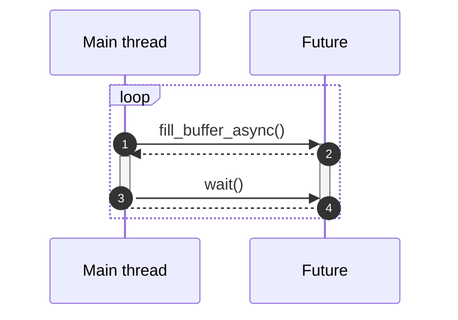

# buffered plugin for MADS

This is a Source plugin for [MADS](https://github.com/MADS-NET/MADS). 

This plugin is a template taht shows how to acquire and publish data collected at high frequency. In fact, MADS agents work fine up to a timestep of a millisecond, but if you need faster acquisition (e.g. for sound or vibrartion) you want to buffer the data and publish a set of samples in batches.

At the moment, the code only shows how to buffer the data and publish the batch, but the `MovingWindowStats` class (provided in `src/moving_window_stats.hpp`) can be used for doing some preprocessing on the batches (in this case, FFT and ACF plus some basic statistics).

In case the FFT is needed, it would be probably wiser to only publish the list of peaks frequencies and their magnitudes, rather than the whole spectrum.

*Required MADS version: 1.4.0.*

## Implementation details

The code provides the base class `Acquisitor`, which is supposed to be derived for real applications.

The class `SerialportAcquisitor` provides an example. Things to remember when deriving the base class are:

* The class constructor expects a `nlohmann::json` object containing the `capacity` field, which is the batch size (number of samples)
* The base class has a template argument, which describes how a single sample is bundled. Derived classes must pick the proper container. For efficiency, we suggest to use a `std::array<double, size>` type, where `size` is the number of scalars in each sample. For example, a 6-DoF IMU would need a  `std::array<double, 6>`, or `std::array<float, 6>` if low resolution is enough, or `std::array<unsigned int, 6>` if reading raw ineger data.
* The class provides the `Acquisitor::sample` struct, which represents a single sample, made by a `time` timestamp plus the `data` field (whis time is the class template param)
* The derived class must implement its constructor and:
  *  the `setup()` method, that prepared the device for reading data/measurements
  *  and the `acquire()` method, which reads a **single sample** of data and properly pack it into the `Acquisitor::sample` struct
*  The plugin class file should only be changed to update the `#include` for the acquisitor subclass and by updating the type of the `_acq` smart pointer (at the end of `setup()` and in the list of class members). Also the data packaging in `get_output()` must be adapted to the case.

## Multi-threaded operation

The `get_output()` implementation in `src/buffered.cpp` and `src/buffered_sp.cpp` uses *futures* to provide a multi-threaded operation, so that the data packaging and elaboration happens **in parallel** to data acquisition, as depicted here:



This way, acquisition is requested in (1) from the main thread and starts immediately in (2) on the Future, which returns right away to the main thread. The latter starts preprocessing and packaging the data into JSON, and when it is done, it waits for the future to become available (3). When the acquisition is completed (4) the main thread moves to the next iteration (i.e. next call to `get_output()`).

Under normal conditions, the acquisition is continuous and there are no *noticeable* gaps. If the time needed for preprocessing and packaging data from the main thread is longer than the buffer acquisition time, though, a warning is raised, for that means that processing is too slow. Depending on the algorithms, increasing the buffer size *might* solve the issue. If it doesn't, one can only slow down the acquisition or make the preprocessing more efficient, or delegate the preprocessing to another agent and publish the data unprocessed (only packaged as JSON). 


## Supported platforms

Currently, the supported platforms are:

* **Linux** 
* **MacOS**
* **Windows**


## Installation

Linux and MacOS:

```bash
cmake -Bbuild -DCMAKE_INSTALL_PREFIX="$(mads -p)"
cmake --build build -j4
sudo cmake --install build
```

Windows:

```powershell
cmake -Bbuild -DCMAKE_INSTALL_PREFIX="$(mads -p)"
cmake --build build --config Release
cmake --install build --config Release
```


## INI settings

The plugin supports the following settings in the INI file:

```ini
# Simple plugin, generating random data
[buffered]
capacity = 10 # Buffer capacity

# More complex plugin, collecting data by an Arduino
# with code on https://github.com/MADS-NET/arduino_plugin/tree/main/arduino/mads
[buffered_sp]
port = "/dev/cu.usbmodem34B7DA5F9A5C2"
baud = 115200
timeout = 100
```

All settings are optional; if omitted, the default values are used.


---